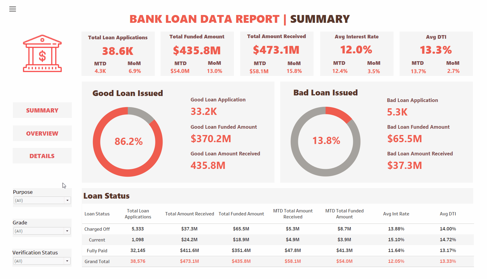

<div align="center">

  <h2 align="center">Bank Loan Data Analysis</h2>

  This project utilizes SQL and Tableau to analyze a dataset of U.S. bank loan data for the year 2021, <br /> generating a Tableau visualization report that consists of three dashboards: Summary, Overview, and Details.

  <p align="center">
  <a href="https://public.tableau.com/app/profile/whojayy/viz/BankLoanDataAnalysisProject/SUMMARY"><strong>➥ Live Demo</strong></a>
  </p>

  <br />
  
  *Dashboard Demo Screenshots*
    

  *When you enter my Tableau visualization project, if your screen cannot fully display all the content of the dashboard, <br /> please use your browser's zoom function to view the entire dashboard.*
  

</div>

## User Guide

In the ```summary dashboard```, you can click on filters for Purpose, Grade, and Verification Status to explore bank loan data for the year 2021. This includes Total Loan Applications, Total Funded Amount, Total Amount Received, Average Interest Rate, Average Debt-to-Income Ratio (DTI), along with their monthly averages and monthly growth rates. Additionally, information on Good Loan Issued, Bad Loan Issued, and Loan Status is available.

<div align="center">

*GIF Sample Demonstrating Operations on the Summary Dashboard*
 

</div>

In the ```overview dashboard```, you can also click on filters for Purpose, Grade, and Verification Status to explore bank loan data for the year 2021. Additionally, you can explore a summary of monthly data, bank loan details for each state in the U.S., loan terms, borrower's years of employment, loan purposes, and the homeowner status of the borrower. When clicking on these diagrams, the data will interactively change across all diagrams and tables.

<div align="center">

*GIF Sample Demonstrating Operations on the Overview Dashboard*
 

</div>

In the ```details dashboard```, you can also click on filters for Purpose, Grade, and Verification Status to explore bank loan data for the year 2021. In addition, you can click on the main table's headers to sort and filter, and you can scroll through the main table to view all the loan data records for the banks in 2021.

<div align="center">

*GIF Sample Demonstrating Operations on the Details Dashboard*
 

</div>


## Explanation of Terms Used in the Report

**MTD (Month-to-Date):** Refers to the cumulative total for the current month up to the current date.

**MoM (Month-over-Month):** Represents the percentage or absolute change compared to the previous month.

**DTI (Debt-to-Income Ratio):** DTI measures the borrower's debt burden relative to income. It gauges the borrower's capacity to take on additional debt.

**Good Loan:** This category includes loans with a loan status of 'Fully Paid' and 'Current.'

**Bad Loan:** This category specifically includes loans with a loan status of 'Charged Off.'

**Grade:** Grade represents a risk classification assigned to the loan based on creditworthiness. Higher grades signify lower risk. Sub Grade refines the risk assessment within a grade, providing additional risk differentiation.

**Verification Status:** Verification Status indicates whether the borrower's financial information has been verified. It assesses data accuracy.

**Loan Status:** Loan Status indicates the current state of the loan (e.g., fully paid, current, default). It tracks loan performance.
```

